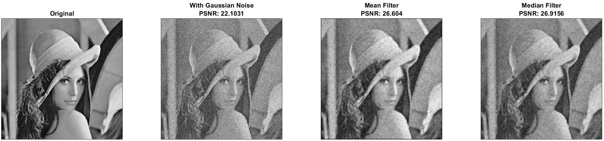

# ImageProcessing
## Description
This repo contains homeworks done as part of the ImageProcessing course in Haifa University, Israel 
In order to receive the results for each HW, simply run script.m file

### HW 1
#### Qunatization
Using <b>Lyod-Max Algorithm</b> for Optimal Quantization from 8 to 4 bits 
Optimal Quantization improves False Contours

#### Binarization
Using <b>Lyod-Max Algorithm</b> for Optimal Binarization from 8 to 1 bit 
Optimal Binarization makes objects distinguishable from background

Adaptive Binarization with sliding window can make objects distinguishable from background in more complex environment, since it calculates local thresholds instead of singal global

### HW 2
#### Salt-Paper & Gaussian Noise with Median & Mean Filtering
For Salt-Paper noise, Median filtering does better work than Mean filtering as can be seen and also by the PSNR value 

For Gaussin noise, both filters give similar results 

#### Blur & Sharpening
Edge filter is very useful for blurring

### HW 3
#### Spatial Transformation
Using affine and projectional transformation, we create a movie 

